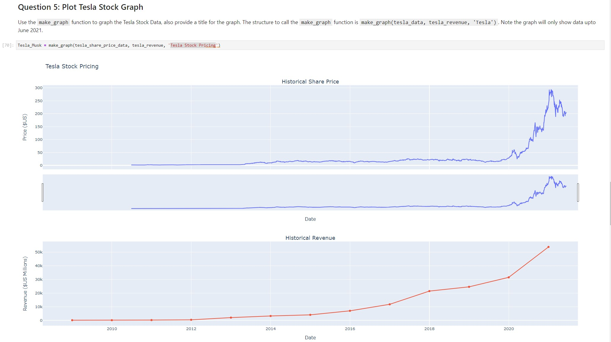
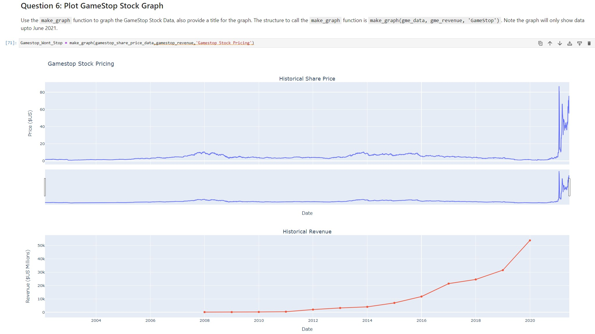

### IBM Project from "Python Project for Data Science" course on Coursera

# Extracting and Visualizing Stock Data

## Description
This project focuses on extracting essential stock data from Tesla and GameStop, and then visualizing the data through graphs. By combining stock data and revenue data, this project aims to provide insights for informed decision-making.

## Table of Contents
- [Define Graphing Function](#define-graphing-function)
- [Part 1: Use yfinance to Extract Stock Data](#part-1-use-yfinance-to-extract-stock-data)
- [Part 2: Use Webscraping to Extract Tesla Revenue Data](#part-2-use-webscraping-to-extract-tesla-revenue-data)
- [Part 3: Use yfinance to Extract Stock Data](#part-3-use-yfinance-to-extract-stock-data)
- [Part 4: Use Webscraping to Extract GME Revenue Data](#part-4-use-webscraping-to-extract-gme-revenue-data)
- [Part 5: Plot Tesla Stock Graph](#part-5-plot-tesla-stock-graph)
- [Part 6: Plot GameStop Stock Graph](#part-6-plot-gamestop-stock-graph)

## Define Graphing Function
The `make_graph` function is defined to create a graph using provided stock and revenue data. It takes three parameters: a dataframe with stock data, a dataframe with revenue data, and the name of the stock.

## Part 1: Use yfinance to Extract Stock Data
For Tesla stock data extraction, the `yfinance` library is utilized. The Ticker function is employed with the ticker symbol 'TSLA'.

## Part 2: Use Webscraping to Extract Tesla Revenue Data
The `requests` library is used to download revenue data from a provided webpage. The data is extracted from the HTML response and saved as 'html_data'.

## Part 3: Use yfinance to Extract Stock Data
Similarly, for GameStop stock data extraction, the `yfinance` library is used. The Ticker function is employed with the ticker symbol 'GME'.

## Part 4: Use Webscraping to Extract GME Revenue Data
Like Tesla revenue data, GameStop revenue data is extracted using the `requests` library. The data is saved as 'html_data'.

## Part 5: Plot Tesla Stock Graph
The `make_graph` function is used to create a graph for Tesla stock data, with a specified title. The function call format is: `make_graph(tesla_data, tesla_revenue, 'Tesla')`. Please note that the graph displays data only up to June 2021.

## Part 6: Plot GameStop Stock Graph
Similar to Tesla, the `make_graph` function is employed to generate a graph for GameStop stock data. The function call format is: `make_graph(gme_data, gme_revenue, 'GameStop')`. The graph visualizes data up to June 2021.

---

*Note: This project is a part of an assignment and may contain simplified or specific instructions for educational purposes.*

